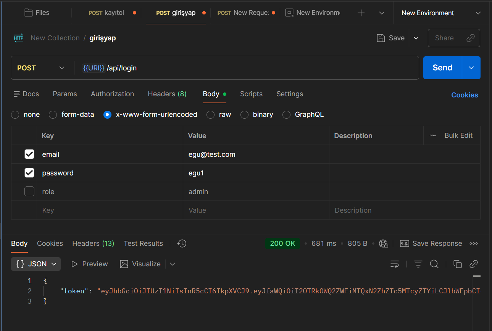
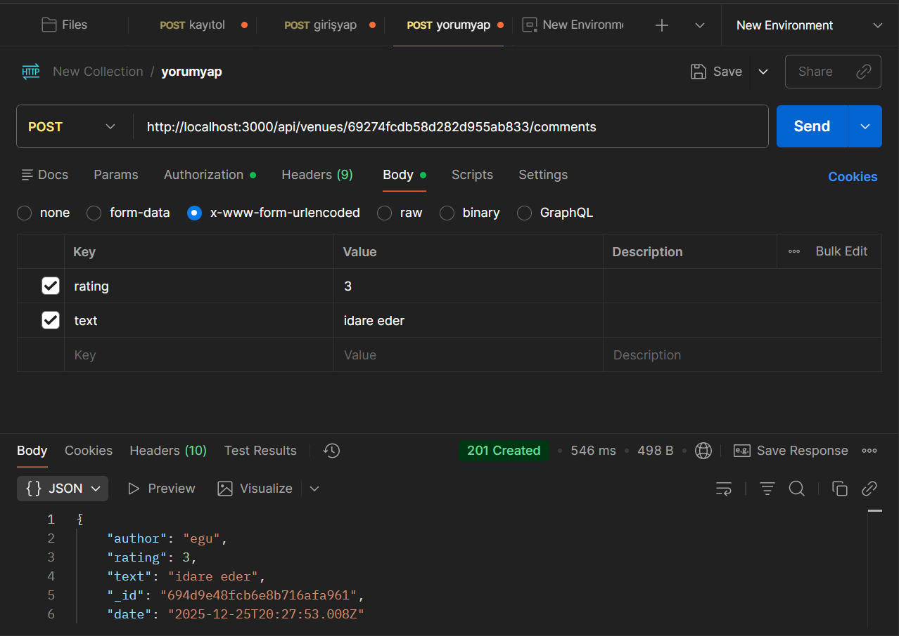

# Mekanbul - Full Stack Mekan Keşif Uygulaması

Bu uygulama kullanıcıların çevrelerindeki mekanları keşfetmelerine, yorum yapmalarına ve puan vermelerine olanak tanır. Ayrıca yetkili kullanıcılar için gelişmiş bir yönetim paneli içerir.

## Canlı Demo Linkleri (Vercel)

Proje hem Frontend hem de Backend tarafında Vercel üzerinde canlıya alınmıştır:

- **Frontend (Kullanıcı Arayüzü):** (https://mekanbul-frontend-seven.vercel.app/)
- **Backend (API Servisi):** (https://mekanbul-backend-omega-flame.vercel.app/)

---

## 🛠 Kullanılan Teknolojiler

Bu proje **MERN Stack** (MongoDB, Express, React, Node.js) mimarisi kullanılarak geliştirilmiştir.

### Backend
- **Node.js & Express.js:** RESTful API mimarisi.
- **MongoDB (Atlas):** Bulut tabanlı NoSQL veritabanı.
- **Mongoose:** Veritabanı modellemesi.
- **JWT (JSON Web Token):** Güvenli kimlik doğrulama (Authentication).

### Frontend
- **React.js:** Kullanıcı arayüzü kütüphanesi.
- **React Router DOM:** Sayfa yönlendirmeleri.
- **Axios:** API istekleri için.
- **Bootstrap:** Responsive tasarım.

---
### Postman Testleri 

