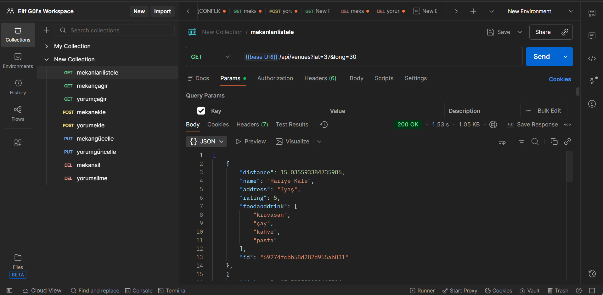
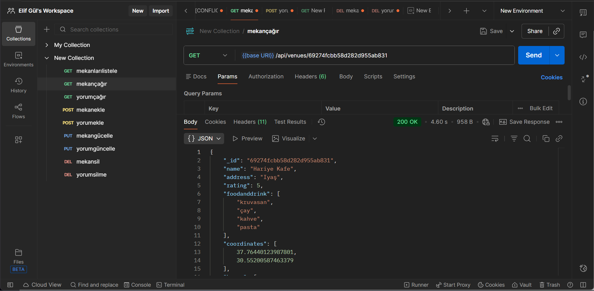
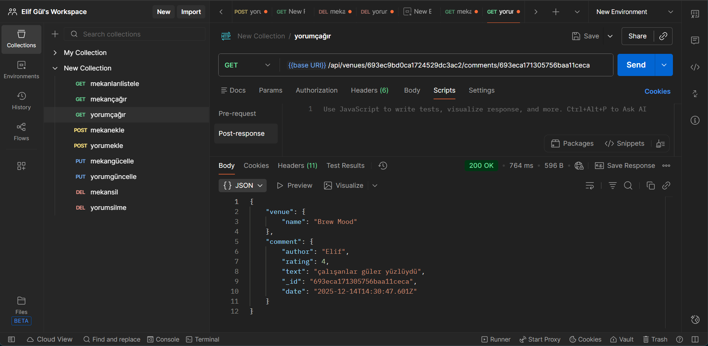
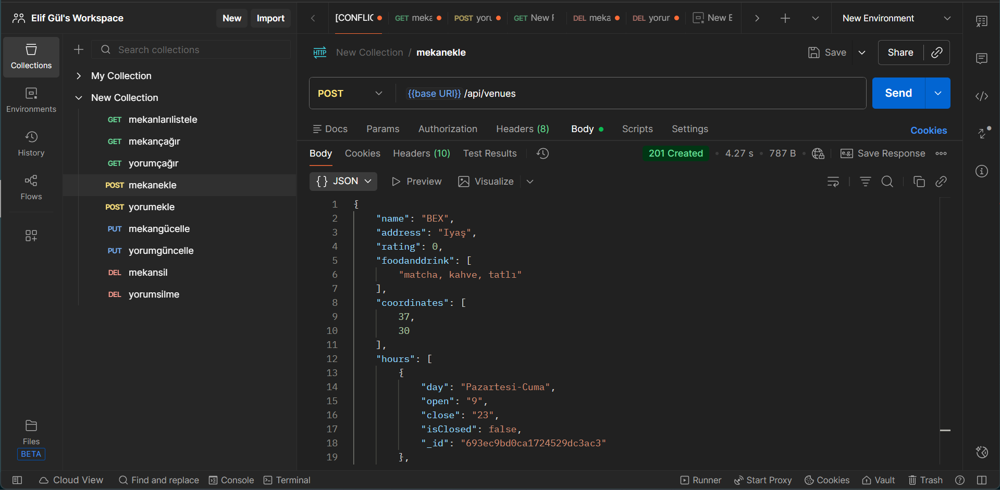
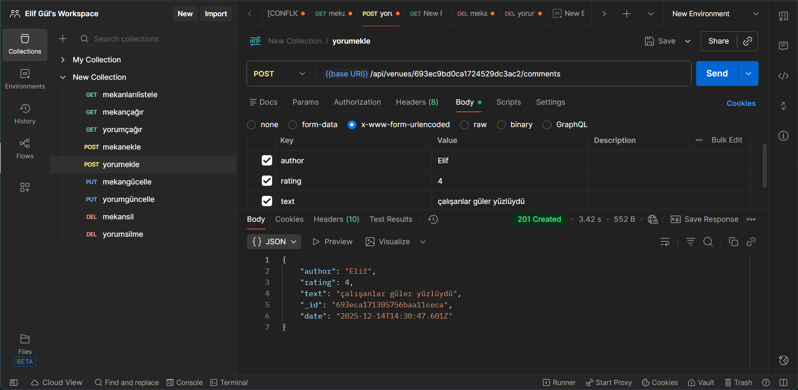
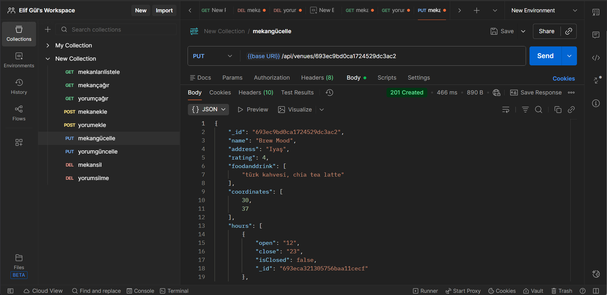
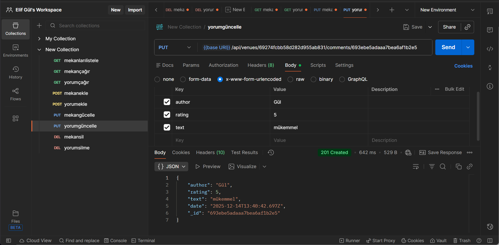
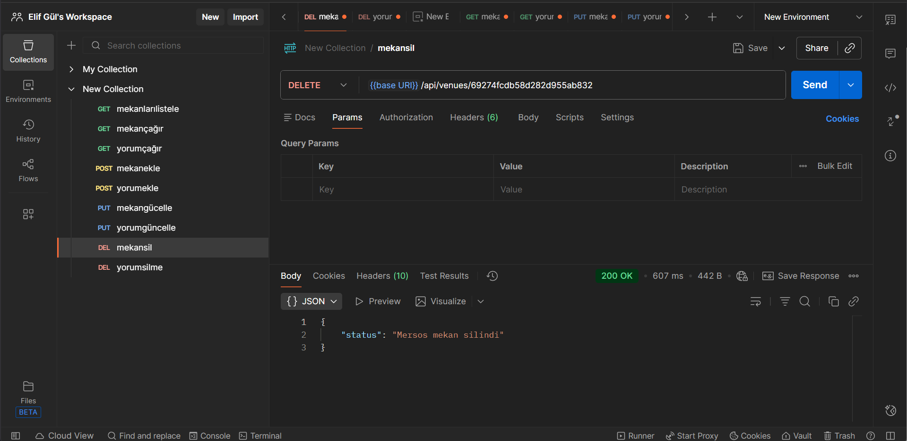

**Demo:** https://backend-virid-beta-u7668ileot.vercel.app/

**API Endpoints**

1.​Tüm mekanları listele: GET /api/venues
​2.Yeni mekan ekle: POST /api/venues
​3.Mekan detayını getir: GET /api/venues/:venueid
4.​Mekanı güncelle: PUT /api/venues/:venueid
​5.Mekanı sil: DELETE /api/venues/:venueid
​6.Yorum ekle (mekana): POST /api/venues/:venueid/comments
​7.Yorum getir: GET /api/venues/:venueid/comments/:commentid
8.​Yorumu güncelle: PUT /api/venues/:venueid/comments/:commentid
​9.Yorumu sil: DELETE /api/venues/:venueid/comments/:commentid

**Postman Test Sonucu**

